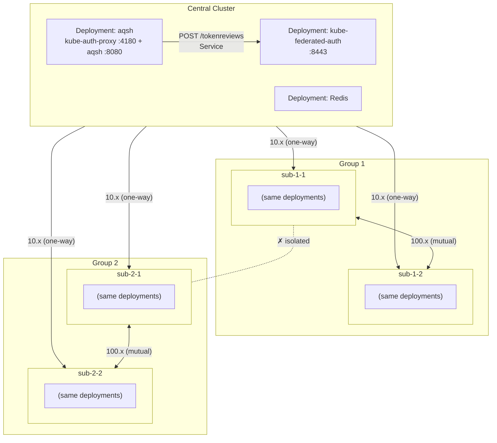
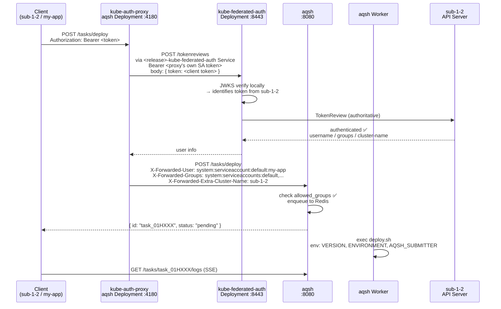
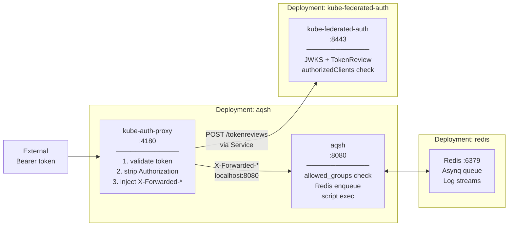

# kube-federated-auth-aqsh

A Helm chart that deploys **independent Deployments** for cross-cluster authenticated async task execution on Kubernetes.

## Deployments

| Deployment | Component(s) | Role | Port |
|---|---|---|---|
| `<release>-kube-federated-auth` | **kube-federated-auth** | Cross-cluster SA token validation backend (TokenReview API) | 8443 |
| `<release>-aqsh` | **aqsh** + **kube-auth-proxy** (optional sidecar) | Async shell script task queue + token validation proxy | 8080 / 4180 |
| `<release>-redis` | **Redis** | Task queue and log stream storage | 6379 |

## How It Works

A service in **Cluster B** wants to trigger a task on **Cluster A**:

1. It sends a request with its own SA token: `Authorization: Bearer <token>`
2. **kube-auth-proxy** (sidecar in aqsh Deployment) intercepts and calls `<release>-kube-federated-auth` Service to validate the token
3. **kube-federated-auth** identifies the source cluster via JWKS (locally, no token forwarding), then calls the original cluster's TokenReview API for authoritative validation
4. On success, kube-auth-proxy strips the Authorization header and injects `X-Forwarded-User`, `X-Forwarded-Groups`, `X-Forwarded-Extra-Cluster-Name`
5. **aqsh** checks `allowed_groups` per task, enqueues the job to Redis, and returns a task ID
6. The aqsh Worker picks up the job, runs the shell script with input as environment variables, and streams logs via SSE

## Access Control

Two independent layers:
- **`authorizedClients`** (kube-federated-auth): which ServiceAccounts may call the TokenReview API — format `{cluster}/{namespace}/{serviceaccount}`
- **`allowed_groups`** (aqsh, per-task): which Kubernetes groups may trigger a specific task — matched against `X-Forwarded-Groups`

## clusterRole

`kubeFederatedAuth.clusterRole` is an **informational-only field** (not passed to the binary). It documents the cluster's role in the federation topology:

| Value | Meaning |
|---|---|
| `central` | Knows all sub clusters; `authorizedClients` lists every sub SA |
| `sub-same-group` | Peers with same-network-group clusters; mutual token validation |
| `sub-isolated` | Standalone sub cluster; no peer-to-peer token validation |

## RBAC Requirements

This chart creates `ClusterRole` and `ClusterRoleBinding` resources — **cluster-admin privileges are required** for `helm install`.

- **kube-federated-auth**: needs `tokenreviews:create` and `serviceaccounts/token:create` at cluster scope to perform local TokenReview and issue SA tokens
- **reader** (sub clusters, `reader.enabled=true`): needs `tokenreviews:create` at cluster scope so the central cluster's KFA can call this cluster's TokenReview API

## Key Design Decisions

- Token source cluster is identified **locally** using JWKS public keys — the token never leaves before cluster identity is known
- kube-auth-proxy calls kube-federated-auth via **Service** (`<release>-kube-federated-auth:8443`), not localhost — independent Deployments
- Remote cluster tokens are **auto-renewed** (7-day TTL, renewed 48h before expiry, stored in K8s Secret)
- Cluster isolation is **config-only** — no NetworkPolicy required; simply omit a cluster from `remoteClusters` and `authorizedClients`
- aqsh scripts can call any sidecar API via `localhost` and optionally write structured JSON to `$AQSH_RESULT_FILE`

---

## Architecture

### Cluster Topology

---

### Request Flow (E2E)

---

### Deployment Architecture

